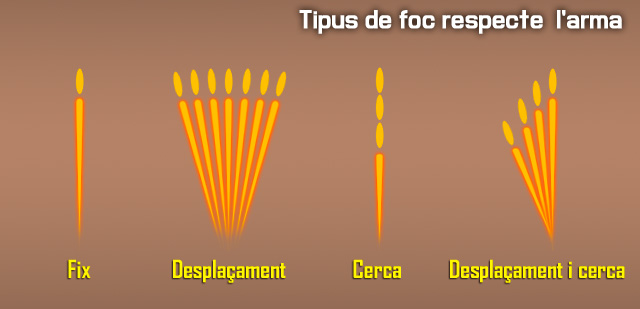
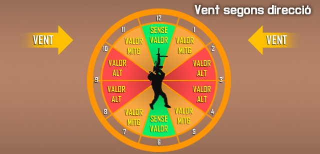

# Emprar armes mes potents i de tripulació

Les armes d'alt calibre o les que estàn colocades sobre plataformes de tir requereixen d'un ús especific per les mateixes, ja que respresenten les armes principals d'una unitat. Aqui aprendreu com fer-les servir.

## Característiques del foc

Cada artiller ha de conèixer els efectes de les bales que dispara. Molts factors influeixen en el vol i l'impacte de la bala.

### Con de foc

Quan moltes bales es disparen en una rafega de qualsevol metralladora, cada bala segueix una trajectòria una mica diferent. El patró que aquestes bales formen en el camí cap a l'objectiu es diu "con de foc". Aquest patró és causat principalment per la vibració de la metralladora i les variacions en la munició i les condicions atmosfèriques.

### Zona de batuda

Aquesta àrea és el patró el·líptic format a terra o a l'objectiu per les bales que impacten. La longitud de la zona de batuda canvia quan la distància al blanc canvia o quan la metralladora es dispara en diferents tipus de terreny. distàncies més curtes i pendents descendents produeixen zones de batudes més llargues, i viceversa.

## Tipus de foc

El foc de metralladora es classifica segons el terreny, l'objectiu i l'arma.

### Respecte el terrenys

El foc respecte el terreny inclou el foc d'abrasió i foc picat.

#### Foc d'abrasió

El foc d'abrasió es produeix quan el centre del con de foc s'eleva menys d'un metre per sobre del terra. En disparar en el nivell de terreny o de manera uniforme en una pendent, l'artiller només pot fer foc d'abrasió a 600 metres.

#### Foc picat

El foc picat es produeix quan la zona de perill està dins de la zona de batuda. El foc picat també es produeix en disparar a llargues distàncies, des de terreny elevat a terreny més baix, cap a una elevació abrupta del terreny, o a través de terrenys irregulars, el que resulta en una pèrdua de foc d'abrasió en qualsevol punt al llarg de la trajectòria.

### Respecte l'arma

Els tipus de foc respecte l'arma inclo foc fix, de desplaçament, de cerca, i de desplaçament i de cerca.

#### Foc fix

Aquest és un foc que es fa servir contra un objectiu puntual quan la profunditat i l'amplada de la zona de batuda cobreix l'objectiu. El foc fix també significa que un sol punt de mira és necessari per proporcionar la cobertura de l'objectiu.

#### Foc de desplaçament

Aquest és el foc distribuït en igual profunditat amb canvis successius en la direcció. L'artiller selecciona successius objectius al llarg de la zona objectiu. Aquests punts d'apuntat han de ser prou a prop per assegurar una cobertura adequada, però no tan a prop com per desaprofitar munició.

#### Foc de cerca

Aquest és el foc distribuït en profunditat per successius canvis en l'elevació. L'artiller selecciona successius objectius/punts d'apuntat al llarg de la profunditat. Els canvis fets a cada punt d'apuntat depenen de la distància i de la pendent.

#### Foc de desplaçament i de cerca

Aquest és el foc distribuït en amplada i profunditat per successius canvis en la direcció i l'elevació. Combinant foc de desplaçament i foc de cerca es proporciona una bona cobertura de l'objectiu.

## Aplicació del foc

L'aplicació del foc es refereix als mètodes utilitzats per cobrir una àrea objectiu. L'entrenament d'aquests mètodes "d'aplicar" el foc és possible només després que els soldats aprengueu a reconèixer els diferents tipus d'objectius que podreu trobar en combat, com distribuir i concentrar el foc, i la forma de mantenir el tipus adequat de foc.

### Tipus d'objectius

Els objectius que es presenten als artillers en combat inclouen les tropes enemigues en diverses formacions, que requereixen una distribució i concentració de foc. Els artillers han de cobrir completament tots els objectius en l'ample i profunditat.

#### Objectius puntuals, foc fix

Els objectius puntuals, com les tropes enemigues, búnquers, emplaçaments d'armes i vehicles blindats lleugers, requereixen l'ús d'un únic punt de mira.

#### Objectius d'àrea, foc de desplaçament i de cerca

Els objectius d'àrea poden ser molt amples i profunds. Quan ho són, aquests requereixen un extensiu foc de desplaçament o de cerca. Els objectius de d'àrea inclouen aquells on la ubicació exacta es desconeix. Els objectius d'àrea inclouen:

##### Objectius lineals (Foc de desplaçament)

Els objectius lineals són prou amples com per requerir punts d'apuntat successius fets a través del foc de desplaçament. La zona de batuda cobreix efectivament la profunditat de la zona objectiu.

##### Objectius profunds (Foc de cerca)

Els objectius profunds requereixen punts d'apuntat fets a través del foc de cerca.

##### Objectius lineals amb profunditat

Els objectius lineals amb profunditat tenen una amplada suficient que requereixen punts d'apuntat successius en els quals la zona de batuda no cobreix la profunditat de la zona objectiu. Un canvi combinat en la direcció i elevació, fet amb foc de desplaçament i foc de cerca, és necessari per cobrir amb eficàcia l'objectiu.

## Distribució, concentració i cadència de foc

La mida i la naturalesa de l'objectiu determina com l'artiller aplica el seu foc. Ell ha de manipular la metralladora per moure la zona de batuda per tota l'àrea objectiu. S'ha de controlar la cadència de foc per cobrir adequadament l'objectiu, però al mateix temps per conservar la munició i preservar el tub.

### Distribució del foc

Distribuir el foc sobre l'amplada i la profunditat de les formacions enemigues.

### Concentració del foc

Concentrar el foc sobre objectius puntuals com les armes automàtiques o les posicions de combat enemigues.

### Cadència de foc

Utilitza cadències de foc sostingudes, ràpides, i cícliques amb la metralladora. Aquestes cadències permeten als líders controlar i mantenir el foc i t'ajuden a evitar la destrucció del teu tub. Més que qualsevol altra cosa, la mida de l'objectiu i el subministrament de munició dicten la teva cadència de foc.

#### Foc sostingut

Aquesta és la cadència normal de foc per l'artiller. El foc sostingut per la M249 és de 50 trets per minut en ràfegues de 3 a 5 bales, amb 4 a 5 segons d'intervals entre ràfegues. En la M60 i M240B són 100 trets per minut en ràfegues de 6 a 9 bales. L'artiller fa una pausa de 4 a 5 segons entre ràfegues. El tub ha de ser canviat després de disparar amb cadència sostinguda durant 10 minuts.

#### Foc ràpid

El tub s'ha de canviar després de disparar amb cadència ràpida durant 2 minuts. Això permet un excepcional alt volum de foc, però només durant un curt període de temps. Segons l'arma:

##### M249

El foc ràpid per la M249 és de 100 trets per minut en ràfegues de 8 a 10, amb un interval de 2 a 3 segons entre ràfegues.

##### M60 I M240B

Per la M60 i M240B, el foc ràpid és de 200 trets per minut en ràfegues de 10 a 12 bales de nou amb un interval de 2 a 3 segons entre ràfegues.

#### Foc cíclic

El foc cíclic utilitza la majoria de munició que es pot fer servir en 1 minut. S'aconsegueix la cadència de foc cíclica amb la metralladora quan el gallet es manté a la part posterior i la munició s'introdueix en l'arma ininterrompudament durant un minut. La cadència de foc cíclica normal per la M249 és de 850 bales, per la M60 és de 550 bales, i per la M240B és 650-950 bales. Canvia sempre el tub després de disparar amb una cadència cíclica durant 1 minut. Aquest procediment proporciona el major volum de foc que la metralladora pot disparar, però això afecta negativament la metralladora, i només hauria de ser emprada en combat en casos d'emergència.

## Efectes del vent

Els efectes del vent varien en funció dels canvis de velocitat i direcció. El vent està classificat per la direcció en la que bufa en relació a la línia de tirador i objectiu. L'artiller utilitza el sistema de rellotge per indicar la direcció del vent i el valor.

Els vents que bufen des de l'esquerra (les 9) o dreta (les 3) es diuen vents de valor alt, pel fet que tenen el major efecte en la bala.

<table>
<colgroup>
<col style="width: 16%" />
<col style="width: 83%" />
</colgroup>
<thead>
<tr class="header">
<th><strong>Rang (m)</strong></th>
<th>Desviació de la bala (cm).</th>
</tr>
</thead>
<tbody>
<tr class="odd">
<td><strong>100</strong></td>
<td>2.54</td>
</tr>
<tr class="even">
<td><strong>200</strong></td>
<td>12.70</td>
</tr>
<tr class="odd">
<td><strong>300</strong></td>
<td>30.48</td>
</tr>
<tr class="even">
<td><strong>400</strong></td>
<td>53.42</td>
</tr>
<tr class="odd">
<td><strong>500</strong></td>
<td>49.06</td>
</tr>
<tr class="even">
<td><strong>600</strong></td>
<td>152.04</td>
</tr>
<tr class="odd">
<td><strong>700</strong></td>
<td>223.52</td>
</tr>
<tr class="even">
<td><strong>800</strong></td>
<td>307.34</td>
</tr>
<tr class="odd">
<td><strong>900</strong></td>
<td>403.86</td>
</tr>
<tr class="even">
<td><strong>1.000+</strong></td>
<td>513.08</td>
</tr>
</tbody>
</table>

Els vents que bufen en un angle des de la zona davantera o posterior es diuen vents de valor mitjans, ja que tenen aproximadament la meitat de l'efecte a la bala que els vents de valor alt. Els vents que bufen directament a la cara o els vents que bufen directament per darrera de l'artiller s'anomenen vents sense valor, perquè el seu efecte en la bala és massa petit per ser una preocupació. Els efectes de del vent incrementen a mesura que augmenta la distància. La taula mostra els efectes d'un vent de 4,47 m/s en diferents rangs. Un vent de 8,94 m/s duplica l'efecte.
