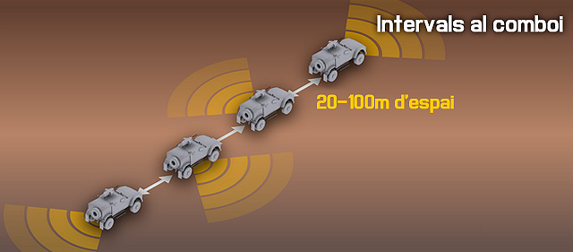
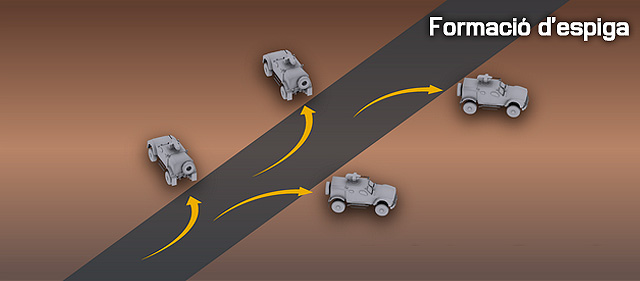
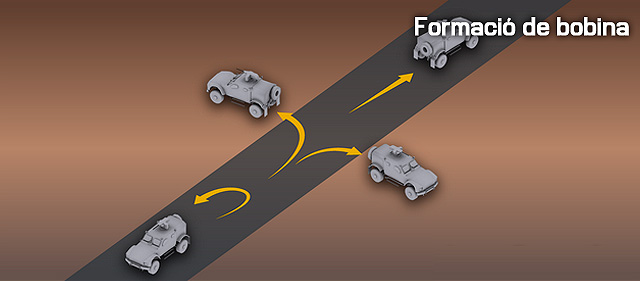
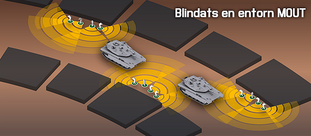

# Defensa del comboi

El més important que has de recordar en prendre un rol de tripulant de vehicle és que en última instància, estàs allà per donar suport a la infanteria. No és la teva feina conduir a tota màquina acumulant baixes enemigues, tu has de fer tot el possible per treballar amb les forces amigues perquè puguis donar millor suport a la infanteria.

## Rols bàsics del vehicle

### Conductor

El conductor es dedica única i exclusivament a conduir el vehicle, i no surt mai si no ho ordena el líder o el vehicle està en perill imminent de ser destruït.

#### Les tasques del conductor són:

  - **Condueixi el vehicle,** d'acord amb les instruccions del teu líder.
  - **Mantén l'espai** quan et moguis amb altres vehicles.
  - **Coneix la formació emprada,** l'ordre de marxa i la teva posició en ell.
  - **Quan s'atura el vehicle sempre roman dintre,** a no ser que s'ordeni el contrari.
  - **Exercir bones tècniques de navegació,** ja sigui per escoltar les instruccions del teu navegador o la navegació pel teu compte en l'absència d'un navegador dedicat.
  - **Mira la carretera a la recerca de signes** de carregues, mines, artefactes explosius improvisats (IED) i explosius en general.
  - **Roman alerta i evita xocar amb altres vehicles,** així com amb els obstacles inesperats en el teu camí.

### Navegador

El navegador és sovint un líder d'Equip de foc. Ell normalment s'asseu al seient del passatger davanter del vehicle i utilitza el seu mapa i la vista del terreny per donar al conductor clares i concises instruccions sobre on anar i com arribar-hi.

#### Les tasques del navegador són:

  - **Dóna la direcció clara i concisa que ha de seguir el conductor en tot moment.** Això inclou la descripció de la ruta, donant avís previ dels girs que poden ser necessaris, etc. El navegador no suposa mai que el conductor sap res sobre la ruta, ha d'indicar-ho tot.
  - **Has d'estar familiaritzat amb el pla de ruta de principi a fi,** per tal de ser capaç de fer canvis de judici si el canvi de ruta es converteix en necessari.

### Artiller

Un artiller té la tasca d'emprar el sistema d'armes de la tripulació, o en el cas d'alguns vehicles, el sistema d'armes a distància (RWS). A causa de la seva posició elevada o l'ús d'un sensor de RWS, ell té una millor observació del terreny que la resta del vehicle i comunica el que veu per ajudar a mantenir la consciència situacional de la resta del vehicle.

Un artiller no baixa del vehicle llevat que l'arma principal sigui buida, quan li és ordenat per el seu líder, o quan es dóna l'ordre general de saltar del vehicle.

#### Les tasques de l'artiller són:

  - **Emprar el sistema d'armes de tripulació** o el sistema d'armes a distància RWS.

  - **Mantingues un alt estat de consciència de la situació** i transmet el que veus als passatgers del vehicle.

  -   - **Escaneja un sector apropiat** per la posició del teu vehicle en la formació general del vehicle o comboi.
        
          - Els vehicles davanters sempre escanegen al capdavant.
          - Els vehicles posteriors sempre escanegen la part posterior.
          - Tots els altres vehicles miren a l'esquerra o a la dreta, alternant.

  - **No desmuntis del vehicle llevat que l'arma principal sigui buida,** quan és ordenat per el teu líder, o quan es dóna l'ordre general de saltar del vehicle.

### Passatger

Els passatgers dels vehicles de transport són en general infanteria que s'embarca amb la finalitat de transportar-los a un combat. L'interès és per tant transportar la tropa de forma segura fins a la zona de combat, i això reflecteix les seves tasques.

#### Les tasques del passatger són:

  - **Examina i comunica les amenaces.** Encara que de vegades no tindràs una bona vista del teu entorn, has d'aprofitar qualsevol punt de vista.
  - **Desembarca per proporcionar seguretat local.** Quan sigui necessari, desembarca la infanteria per garantir la seguretat local per a vehicles. Això es fa generalment mentre sigui temporalment aturada en la ruta fins al seu punt final de desembarcament.
  - **Desembarcar per lluitar.** Un cop al punt final de desembarc, o quan es requereixi, la infanteria ha de desembarcar dels vehicles, formar amb les seves respectives unitats, i començar la lluita assignada. Això pot incloure la reacció a una emboscada del comboi, així com qualsevol altre combat inesperat que podria passar abans del principal objectiu.

## Directrius bàsiques del vehicle

### Pujant al vehicle

Quan es tracta d'embarcar tropes en un vehicle, el procés és senzill, sempre que els líders prenguin la iniciativa i comandament, i els subordinats escoltin i segueixin les instruccions.

Els líders d'element sempre pugen els últims als vehicles. La seva responsabilitat és fer que els membres del seu equip entrin al vehicle que ha estat assignat pel seu superior. Després de ser designat a un vehicle, han de dirigir els seus membres de l'equip perquè pugin, supervisar les operacions de càrrega i ser l'últim soldat en pujar.

Com a regla general, un Equip de Foc intentarà ocupar les següents posicions en un vehicle:

  - **Líder d'equip de foc -** Navegador
  - **Fuseller automàtic -** Passatger. El FA no pren la torreta, ja que fer-ho significaria que el fusell automàtic de l'equip de foc no es podria fer servir si fos necessari desmuntar.
  - **Assistent de fuseller automàtic -** Artiller de torreta o l'operador de sistemes d'armes a distància.
  - **Fuseller -** Conductors o passatgers. El millor conductor s'agafa dels fusellers. En absència de conductors fusellers disposats o capaços, el líder d'Equip de Foc pot convertir-se en el conductor, amb un altre membre de l'equip que actua com a navegant.

### Aturades i desmuntatges

Al desmuntar, els elements d'infanteria han de proporcionar seguretat de 360° com a estàndard. També han de tractar d'aconseguir com a mínim quinze metres des del vehicle per a protegir-se contra explosions primàries o secundàries en el cas que aquest sigui atacat.

#### Quan desmuntar?

  - **Aturada curta** (30 segons o menys), no es desmunta del vehicle.
  - **Aturada llarga**, en una aturada més llarga es desmunta i s'estableix un perímetre de seguretat al voltant del vehicle. Desmuntar i tornar a muntar només es pot fer un cop el líder ho ordeni.
  - **Independentment de la durada d'una aturada**, el conductor i l'artiller sempre romanen muntats. L'única vegada que es deixa el vehicle és si està desactivat o destruït. L'artiller també pot desmuntar si l'arma del vehicle es queda sense munició, per fer servir la seva arma personal.

#### Escaneig 5 i 25

Una exploració "5 i 25" implica l'exploració de la zona immediatament al voltant de vosaltres i del vehicle de 5 metres, a continuació, es fa el desmuntatge i escaneig de 25 metres en totes les direccions. La idea és assegurar-se que el vehicle no s'atura a prop d'una càrrega explosiva oculta. La situació tàctica determinarà la quantitat de temps que s'ha d'emprar.

Tingues en compte que a causa de les peculiaritats del simuladors i dels models de blindatge i protecció de vehicles, el "5 i 25" sovint es converteix en "sortir del vehicle primer i escanejar després", en lloc del procediment més real de l'exploració dels primers 5 metres mentre que encara un és muntat.

#### Consciència Situacional

Tothom en un vehicle a d'escanejar els seus sectors per mantenir la consciència situacional en tot moment. El sector d'exploració d'un soldat dependrà d'on es col·loca al vehicle. La cobertura de 360° és l'objectiu final.

## Coordinació i Comunicacions

Per tal de facilitar les comunicacions entre tripulants d'un vehicle, hi ha una terminologia estàndard inclosa al POC que ajuda a mantenir comunicacions curtes i concises. Aquí tens un petit resum.

### POC per a vehicles

#### Maniobrant

  - **Orienta.** Ordre per obtenir ja sigui el vehicle o l'artiller alineats en una direcció específica. Hi ha diferents mètodes d'orientació possibles, que es descriuen en la següent secció.
  - **Casc baix.** Ordre per posar el vehicle en una posició d'emmascarament del casc. Més detalls (com la direcció d'orientació) es donen quan sigui necessari.
  - **Torreta baixa.** Ordre per retirar el vehicle a un posició d'emmascarament de la torreta.

#### Combat

  - **Dispara.** El comandant indica a l'artiller que pot disparar. L'artiller mai disparar si no ho indica el comandant, a no ser que tingui l'ordre de foc a discreció.
  - **Recarregant.** L'artiller informa que està recarregant l'arma principal.
  - **Disparant.** L'artiller alerta perquè l'equip sàpiga que està disparant les seves armes.
  - **Llarg/Alt.** El comandant o l'artiller ha observat que el tret se'n va per sobre de l'objectiu. L'artiller a d'ajustar la mira.
  - **Curt/Baix.** El Comandant o l'artiller ha observat que el tret s'ha quedat curt de l'objectiu. L'artiller a d'ajustar la mira.
  - **Impacte.** El comandant o l'artiller ha observat que el tret a donat en el blanc directament.
  - **Llest.** L'arma principal és llesta per disparar. En general i sempre es dóna després d'una recàrrega.
  - **FUM, FUM.** Ordre d'emergència del conductor o l'artiller perquè el comandant desplegui fum immediatament. Tingues en compte que si el fum ha de ser emprat en una situació que no sigui d'emergència (per exemple, per emmascarar el moviment d'infanteria), l'ordre es converteix en "Desplega fum" i es parla amb menys intensitat.

#### Disponibilitat

  - **En el blanc.** L'artiller té el blanc en el punt de mira i llest per disparar.
  - **Sense visual.** L'artiller no pot veure l'objectiu que s'ha descrit.

### Orientació

Quan s'ha de dirigir el moviment o l'artiller d'un vehicle blindat, diversos mètodes d'orientació es poden emprar. Tingues en compte que aquesta terminologia és més pensada per vehicles blindats d'atac, però resulta igualment útil per vehicles lleugers.

  -   - **Orienta.** L'ordre "Orienta" informa a l'artiller o el conductor per alinear-se amb l'orientació del comandant del vehicle. Aquest mètode és molt ràpid i fàcil per al comandant i l'artiller/conductor, però no serà tan precís com donar un rumb. Exemple:
        
          - "Artiller, orienta." L'artiller gira la torreta cap a la direcció de la torreta comandant.
          - "Conductor, orienta." El conductor gira el vehicle per fer front a la direcció de la torreta comandant.
          - "Conductor, orienta sobre artiller." El conductor del vehicle gira cap a la direcció de la torreta de l'artiller.

  -   - **Rumb de brúixola.** Fent servir la brúixola digital el comandant llegirà el seu rumb per indicar a l'artiller/conductor la direcció a mirar. Aquest mètode és molt precís i generalment el mètode preferit d'utilitzar. Exemple:
        
          - "Artiller, orienta 235". L'artiller orientarà a un rumb de 235 graus.
          - "Artiller, blanc, 115, tanc." L'artiller ha de orientar a 115 graus per detectar i atacar un tanc.
          - "Artiller, el sector de foc és 070-165." L'artiller buscarà un arc que s'estén de 070 a 165 graus fins que li indiqui el contrari.

  -   - **Orientació del rellotge.** Quan s'utilitza el mètode de rellotge, el casc del vehicle forma la referència 12:00. Tingueu en compte que aquest mètode no és molt precís i només s'ha d'utilitzar a curtes distàncies. També pot ser utilitzat per qualsevol membre de la tripulació (conductor, passatger, carregador) que veu un objectiu que la tripulació de la torreta no ha vist encara.
        
          - "Conductor, camió amic en marxa a les nostres cinc". El conductor és alertat del fet que un vehicle es troba molt a prop, en una direcció donada.

  -   - **Direcció relativa.** Adreces relatives són les orientacions simples. Això és simplement l'acte de dir "esquerra", "dreta", "esquerra-frontal", etcètera. Les direccions relatives s'utilitzen amb més freqüència quan es guia el conductor o el foc des d'un punt conegut. Exemple:
        
          - "Conductor, infanteria amiga a la nostra esquerra, molt a prop." El conductor és alertat dels amics a prop, el que el fa ser més prudent en les seves maniobres.
          - "Artiller, orienta dreta, escaneja la línia d'arbres." L'artiller mantindrà una orientació cap a la dreta del vehicle a mesura que avança, fent l'exploració de la línia d'arbres designats.

## Operacions de comboi

A l'hora de desplaçar-se amb vehicles en comboi, és important seguir les pautes operatives, i mantenir en tot moment la cohesió per maximitzar l'eficàcia en cas de combat.

### Directrius

#### Velocitat i cohesió

Mantenir una alta velocitat del comboi ajuda a la seguretat, ja que és més difícil per l'enemic apuntar bé, o fer detonar carregues amb precisió. Però un excés de velocitat pot provocar la dispersió del comboi. Per tant cal que mantinguis una velocitat alta però no extrema en la navegació.

Com a norma, no es viatja mai al màxim de velocitat, ja que els vehicles posteriors no podrien accelerar per mantenir la posició si es queden enrere. La velocitat màxima es deixa per situacions critiques.

#### Intervals

Mantenir un bon interval és un aspecte clau de les operacions amb diversos vehicles. Depenent del terreny, els vehicles han de mantenir entre 20 i 100 metres de separació entre si. Això ajuda a disminuir els efectes dels explosius enemics com ara càrregues explosives i artefactes explosius improvisats i fa més difícil per a l'enemic fer foc massiu a diversos vehicles a la vegada.

És particularment important mantenir un bon interval quan hi hagi una aturada temporal.

#### Selecció de la ruta i accions a fer

  - **Evita les àrees urbanes sempre que sigui possible.** És massa fàcil per a una força enemiga planejar una devastadora emboscada en una zona urbana. Les rutes que passen per zones molt boscoses o extremadament rocoses són igualment perilloses, però a causa de la naturalesa d'alguns terrenys, no sempre es poden evitar. La precaució és la millor defensa en aquest cas.
  - **El comboi ha de saber a on anar, i ha de ser planejat per endavant amb cursos de seguretat de l'acció.** Si cada conductor sap el camí que se suposa que ha de prendre, i quin és l'objectiu final, això farà que siguin capaços de prendre millors decisions tàctiques en situacions d'alt estrès.
  - **El comboi ha de conèixer les accions a seguir.** Si els vehicles entren en contacte, els conductors han de saber el que han de fer. Correspon al comandant del comboi d'assegurar-se que les accions a seguir s'informin abans que el comboi comenci a rodar.

#### Consciència i Seguretat Situacional

  - **Els artillers han de cobrir els sectors corresponents.** El primer vehicle d'un comboi mira a la part davantera, l'últim vehicle mira a la part posterior, i els vehicles del mig alternen entre dreta, esquerra i dreta, de manera que les armes estan apuntant en totes les direccions d'amenaça en tot moment. És important que els artillers mantinguin la seva observació 360° fins i tot quan el contacte sembli principalment venir d'una direcció específica, si no, és fàcil per a l'enemic explotar això.
  - **La cohesió i la seguretat en les aturades són crítiques.** El manteniment d'una formació coherent i utilitzar bones mesures de seguretat són fonamentals per a la supervivència del comboi. Si un aturada completa s'ha de dur a terme, la infanteria desmuntada s'ha d'emprar per mantenir el comboi segur mentre resti aturat.

#### Accions a fer

##### Contacte – Empènyer a través

Si ets emboscat, el procediment estàndard és lluitar mentre continues embarcat i no aturar-te fins que hagueu sortit de la zona de mort. Si l'enemic comença a disparar contra un comboi, els artillers han de moure immediatament les seves armes per realitzar un gran volum de foc de resposta. Fins i tot si els artillers no poden veure l'enemic, han de disparar sobre la direcció d'on estan rebent foc. Una vegada que s'inicia una emboscada, el conductor del vehicle punta ha d'estar particularment vigilant en la seva exploració de la carretera. Les probabilitats que un IED o un altre explosiu sigui col·locat en el camí són extremadament altes, i es requerirà d'una fracció de segon per evitar aquest tipus de dispositius.

Quan es produeix una emboscada, "empènyer a través" es fa a menys que s'indiqui el contrari.

##### Contacte - Desmuntar i assaltar a través

El mètode alternatiu de tractar amb contacte com un comboi és d'assalt al contacte. Això es fa amb l'ordre verbal de "Assalt a través\!". Quan es dóna aquesta ordre, les tropes desembarquen mentre els artillers de vehicles obren foc pesat sobre les posicions enemigues. Els desembarcats i els vehicles procedeixen a maniobrar cap a l'enemic i destruir-lo. Quan l'enemic ha estat derrotat, les tropes tornen a embarcar i segueixen endavant amb la missió.

Tingueu en compte que quan s'assalta a través, la infanteria i els vehicles encara continuen interessats en romandre a la ruta del comboi. Tenen una mica de llibertat en maniobrar fora de la ruta per portar la lluita a l'enemic, però no massà per no portar-los a una posició favorable a l'enemic (no caure en un parany).

#### Aturades de comboi

Quan s'atura un comboi, apilar simplement els vehicles a la carretera un darrera l'altre no és la forma ideal de fer les coses. Si bé això pot ser utilitzat per aturades molt breus, la millor opció per a la reacció al contacte o aturades de més durada és o bé la formació d'espiga (preferible, ja que és el més fàcil de fer) o la formació de bobina.

Tingues en compte, que la infanteria ha de dur a terme els procediments de desembarcar i proporcionar seguretat local sempre que es facin aturades de comboi, com es va descriure anteriorment.

##### Formació en espiga

Aquesta és la formació estàndard a utilitzar en aturar un comboi. En aquesta formació, els vehicles surten fora a banda i banda de la carretera d'una manera alterna. El primer vehicle tira a la dreta, a l'esquerra el segon, el tercer a la dreta, i així successivament. Els vehicles es queden aproximadament en un angle de 45° amb relació a la carretera. Aquesta formació és fàcil d'executar i permet al comboi d'aconseguir una bona seguretat quan s'atura. Aquesta formació pot ser utilitzada en terreny obert, en aquest cas la direcció del moviment es converteix en el "camí" i els vehicles es mouen en relació a aquesta.

##### Formació en bobina

L'altra formació que es pot utilitzar és més orientada cap als vehicles blindats. Quan s'executa una formació de bobina, el primer vehicle s'atura i mira cap endavant, el segon vehicle tira cap a l'esquerra i s'encara a esquerra (establint el seu blindatge frontal a l'esquerra), el tercer vehicle tira cap a la dreta i s'encara a la dreta, mentre que el vehicle cua gira perquè estigui orientat cap a la part del darrere. Això permet que els vehicles puguin col·locar el seu blindatge més fort en la direcció que estan cobrint i proporciona una excel·lent seguretat de 360°.

#### Reconeixement a peu i guies de terra

Quan la situació tàctica ho permet, el comandant d'un vehicle pot desembarcar per fer una 'reconstrucció a peu'. Això es realitza normalment quan el vehicle és al limit del terreny (a punt de passar la part alta d'un turó per exemple). El desembarc i la comprovació sobre la cresta a peu permet al comandant de decidir on podrien ser les possibles amenaces enemigues, localitzar amenaces òbvies, i triar on i com passar la cresta del terreny. Però aquesta és una situació d'alt risc, i per tant només es pot fer en situacions de màxima seguretat, i mai en ple intercanvi de foc.

Les guies de terra, d'altra banda, és la infanteria que camina davant d'un vehicle per guiar-lo a través d'una àrea difícil. Les guies de terra poden ser utilitzades per aconseguir col·locar un vehicle específicament on la infanteria ho necessita, per ajudar als vehicles a passar a través d'una àrea potencialment minada, o per ajudar-los a navegar a través de terreny atapeït o confús.

#### Llançar el pes al voltant

En funció del seu pes i resistència, els vehicles poden ser utilitzats per enderrocar arbres, matolls, parets i altres obstacles a fi d'aclarir els carrils de foc i observació per si mateixos o la infanteria que donen suport. Els tancs són generalment capaços d'enderrocar qualsevol cosa, mentre que els camions en general es centren en els matolls i parets petites per evitar els danys greus.

Cal una estreta coordinació amb els comandants de la infanteria amb la finalitat de crear carrils eficaços de foc que s'integrin en els plans defensius de la infanteria recolzada. Massa arbres derrocats, o forats a les parets, poden posar en perill la capacitat de la infanteria de suportar una defensa eficaç.

Tingues en compte que, a més de la neteja dels obstacles, els vehicles també poden ser utilitzats per crear una millor ocultació. Un tanc pot tenir dificultats per trobar l'ocultació en una zona on els arbres tenen les seves branques massa altes d'un nivell per emmascarar el tanc, però, colpejar un arbre perquè caigui pot proporcionar ocultació de sobte.

#### Avançar en entorn MOUT amb blindats

Quan s'avança per zones poblades, els blindats són especialment vulnerables als atacs. Tenen una restringida visibilitat de l'entorn proper, i poden ser fàcilment atacats per altres vehicles emboscats o infanteria amb armes antitancs. Per evitar això, la infanteria a peu ha de proveir la seguretat perimetral dels vehicles en el seu avanç.

Per fer-ho, els diferents elements de la infanteria s'intercalen amb els vehicles, i avancen al mateix temps. Per fer-ho correctament i evitar accidents, els vehicles han de saber en tot moment on són les tropes a peu, i hi ha d'haver una comunicació constant entre els comandants dels blindats i els líders d'element.

Caution

> Cal recordar que la intensa proximitat entre blindats i soldats a peu obliga a extremar la precaució per evitar accidents.
