# Operacions militars a terreny urbà (MOUT - Military Operations in Urban Terrain)

Les Operacions militars en terreny urbà (MOUT) i Close Quarters Battle (CQB) són fàcilment l'ambient més perillós per operar de la infanteria. Les amenaces poden venir de dalt, o aparèixer i desaparèixer en un instant en el desordre urbà. El combat és ràpid, violent i confús. Es necessita una bona comunicació a tots els nivells per proporcionar informació oportuna, així com evitar els incidents de foc amic. El combat MOUT a nivell d'Escamot s'ha de fer a un ritme deliberadament metòdic, i tots els elements han de ser capaços de moure's d'una manera coherent que eviti que ningú pugui quedar aïllat o perdut, i mantenir un alt nivell de consciència de la situació i defensa cohesionada.

## Consells per a la infanteria en un entorn MOUT

Hi han diversos consells per als soldats d'infanteria que opereu en aquests entorns.

  - **Estar alerta de l'element vertical en un entorn MOUT.** Els enemics poden ser a les teulades o pisos superiors, i es requereix una aguda observació de tots els membres per detectar-los abans que puguin fer mal.
  - **Coneix al teu sector d'observació/cobertura i sigues diligent en vigilar/cobrir-lo.** Si un membre abaixa la guàrdia durant uns segons pot condemnar-ne a molts. Cobreix en tot moment el teu sector.
  - **Vigila les zones de perill.** La passada d'habitació és simplement el procés de moure't acurada i deliberadament d'una manera que et permeti veure la major quantitat de superfície possible abans d'entrar-hi. Això té una multitud d'usos en totes les àrees de combat, però es torna particularment important en el MOUT, amb edificis i carrers. Fer una passada d'habitació et permet tenir una visual clara de tota l'habitació a excepció d'una cantonada o dos, el que et permet entrar i immediatament centrar-te en les àrees de perill (és a dir, les cantonades sense netejar) sense haver de fer un escombrat complet de la resta de l'habitació al mateix temps.

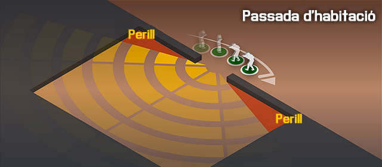

  - **Mantenir-te allunyat de les parets.** Les parets actuen com a teló de fons perquè les bales explosives detonin en elles, i estar massa a prop d'elles farà que sigui molt més fàcil per a un enemic llançar una granada o coet cap a tu i eliminar-te. T'enfrontaràs constantment al dilema de si estar a prop d'una paret et proporcionarà protecció o et posarà en un risc addicional, sospesa les opcions de forma ràpida i escull el millor per a l'escenari en el que estàs.
  - **Estigues fora d'espais oberts.** Mou-te de posició coberta a posició coberta, i evita restar en zones obertes. Els carrers són vies de mort naturals en les zones urbanes i estan freqüentment coberts per metralladores.
  - **Mou-te amb deliberació.** En el combat MOUT, el moviment desordenat, la velocitat massa ràpida i les unitats massa separades es tradueix fàcilment en víctimes.
  - **El fum és extremadament eficaç en MOUT, fes-lo servir\!.** Empra fum correctament, i fes-lo servir per al màxim efecte sempre que sigui possible. Una granada de fum ben col·locada pot emmascarar un carrer sencer o una part d'un edifici i salvar vides.
  - **Les metralladores, emplaçades correctament, poden tallar un carrer sencer (o més).** Emplaçar les metralladores correctament pot ser un factor molt important per guanyar un combat urbà.
  - **No comprometis tota la teva esquadra dintre d'una estructura de mida mitjana.** Els edificis més grans poden tenir més d'un equip, però els mitjans o petits no són suficientment grans perquè varis equips els ocupin, sense evitar la possibilitat de quedar tota l'esquadra atrapada.

## Creuant les zones de perill urbanes

Cada membre de l'equip ha d'estar familiaritzat amb el que ha de fer quan es tracta de zones de perill a l'entorn urbà. A causa de la naturalesa caòtica i de ritme ràpid del combat urbà, no hi ha estrictes rols de cada membre de l'equip de foc per prendre en creuar zones perilloses urbanes.

A l'hora d'avançar per terreny urbà, hi han dos tipus bàsics de moviments, avançament en columna (o columna doble) i avançament a salts. El primer proporciona un avançament ràpid però menys segur, mentre que el segon millora la cobertura sacrificant la velocitat.

### Avançament en columna (doble)

La idea de l'avançament en columna, és mantenir un ritme d'avançament constant mentre cada membre de la unitat vigila el seu sector, mantenint una cobertura de 360º. La unitat formaria una columna típica, i mantindria els mateixos sectors de cobertura coneguts, però amb menys separació entre soldats. La columna doble segueix el patró ja conegut, i és la formació recomanada per avançar. Cal com a mínim dues esquadres o dos equips de foc per portar-la a terme, tenint en compte que una tercera esquadra o equip de foc s'encarregaria de la seguretat posterior.

#### Execució

El primer i segon equip de foc avançarien en paral·lel. El primer soldat de cada equip apunta a l'avanç de la formació sent l'home punta, els següents són designats soldats de cobertura. La seva responsabilitat és guiar a l'home punta segons les indicacions del líder de la unitat i cobrir l'angle de 45º oblic respecte el company. El segon soldat de cobertura s'encarrega de cobrir al davant quan l'home punta està explorant portes i cercant enemics. El tercer i el quart soldat de cobertura són responsables de la seguretat llunyana dels flancs. Un cobreix els nivells superiors i l'altre cobreix els nivells inferiors com finestres, portes o escales. El quart soldat a més proveeix la seguretat posterior en cas de ser l'ultima soldat de la columna o enllaça el seu sector de foc amb el primer soldat de la següent columna. Si el primer i segon soldat estan explorant obertures en busca d'enemics, el tercer soldat s'encarrega de cobrir al davant.

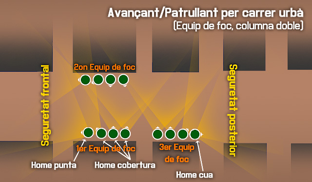

Els dos últims soldats de l'esquadra a cada columna s'encarreguen de la seguretat posterior. S'han de moure a salts per tal de proveir constantment de cobertura posterior, es pot fer servir el salt cobert successiu com l'alternat.

##### Salt alternat

L'ultim soldat de la formació a de tenir l'arma preparada i anar amb perfil baix. Llavors el segon soldat de la cua, gira, avança 10-15m cap al davant, torna a girar, fa un pas de separació de la paret i assumeix un perfil baix de cobertura, anunciant «Cobrint\!». Llavors l'últim soldat gira i avança fins a reunir-se amb la columna, passant per darrera del segon soldat de la cua que el cobreix, fent aquest un pas de nou cap a la paret quan passi el company. El procés es continua fent en tot l'avançament. El líder de l'equip de foc de rereguarda ha de coordinar els moviments per evitar que la parella de seguretat es pugui quedar massa separada del grup

##### Salt successiu

En aquest mètode, l'ultim soldat sempre és l'ultim soldat després del salt. El procediment és el mateix, però quan avança, en comptes d'arribar a la columna, s'atura quan arriba a l'alçada del segon soldat de seguretat posterior.

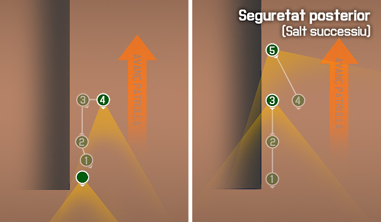

## Creuant una intersecció de carrer

Una cruïlla (intersecció de quatre vies) és una zona molt perillosa que s'ha de creuar ràpidament. La seguretat en una intersecció és extremadament important per a la protecció de les unitats que creuen. Quan es mouen, els soldats punta cal que notifiquin als líders de la unitat, a través dels soldats de cobertura, d'una intersecció que s'acosta. Creuar la intersecció obligarà els tres elements d'una unitat en moviment al llarg d'un carrer de la ciutat de rotar posicions i assumir les responsabilitats apropiades.

Execució amb escamot

1.  **El primer equip de foc en creuar.** Els equips de foc líders (primers) en les dues columnes han de fixar simultàniament la seguretat al voltant de les cantonades de l'edifici. Això permet disposar de seguretat donant suport mútuament al capdavant directe, la seguretat de l'edifici a l'altre costat de la intersecció, i la seguretat de la pròpia intersecció. Els equips de foc d'enmig (segons) proporcionen suport de flanc i la seguretat posterior. Els equips de foc posteriors (tercers) es mouen cap endavant, creuant la intersecció, i assumint la missió de seguretat dels equips de foc líders (primers).

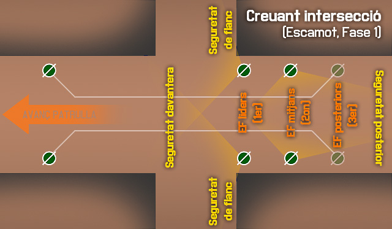

2.  **El segon equip de foc en creuar.** Els primers equips de foc (ara els equips de foc d'enmig) segueixen proporcionant seguretat a la intersecció i assumeixen la seguretat de l'àrea posterior. Els segons equips de foc (ara equips de foc del darrere) creuen la intersecció en ordre. Els segons equips de foc es posicionen per proporcionar seguretat posterior i de la intersecció per donar suport a la cobertura dels últims equips de foc.

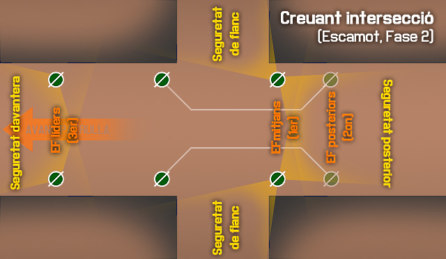

3.  **El tercer equip de foc en creuar.** Els primers equips de foc (ara els equips de foc del darrere) proporcionen seguretat posterior i creuen la intersecció en ordre. Els primers equips de foc sobrepassen els segons equips de foc per esdevenir els equips de foc d'enmig i proporcionar suport mutu amb al davant i la seguretat del flanc. Els segons equips de foc es converteixen en la seguretat posterior.

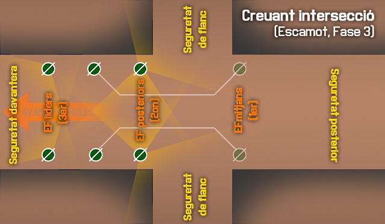

4.  **Les esquadres i els tres equips de foc han creuat la intersecció,** i els equips de foc han rotat. Aquesta rotació és convenient, ja que alterna les unitats líders, que poden fatigar-se ràpidament durant les operacions MOUT. Els mateixos procediments s'utilitzen per creuar una intersecció amb una sola columna.

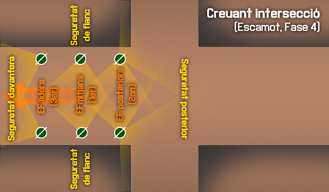

## Procediments de cobertura

Hi han diferents sistemes de cobertura per cada acció a realitzar en MOUT.

### Salts

A l'hora d'avançar pels carrers, els equips i les parelles s'han de cobrir mútuament en tot moment, mentre un cobreix, l'altre avança. El sistema és el següent.

1.  El que està davant es col·loca en posició, preferiblement amb un genoll al terra, apuntant amb l'arma i escanejant l'angle fosc del companys, llavors avisa que està cobrint dient **Cobrint\!**.
2.  El company decideix ràpidament la ruta que farà en el salt, i cridant **Saltant\!** abans d'avançar es mou cap a la posició de salt final. Un cop arriba, es prepara per cobrir, i només quan ja està cobrint, informa al company dient **Cobrint\!**.

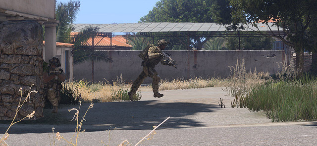

En cas de ser tota una esquadra o equip que està saltant, l'últim en saltar a de dir últim\! quan arriba a la posició final per informar que ha passat tot el grup.

És important que recordis que has d'estar sempre preparat per atacar, sobretot en un entorn MOUT, esprintar només farà que quan aparegui un enemic no tinguis capacitat de reacció, ja que hauràs de recobrar el pols normal i estabilitzar l'arma, el que pot trigar massa. És millor trigar una mica més en avançar, però mantenint en tot moment la capacitat de foc immediat.

### Agrupació alta/baixa cantonada

Per cobrir més efectivament una cantonada, dos soldats es poden col·locar a la mateixa, un amb perfil baix i l'altre amb perfil alt. Mentre el de perfil baix cobreix el carrer, el company en perfil alt cobreix l'angle de 45º del company.

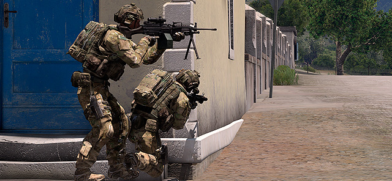

Per netejar la cantonada de cop es pot emprar la tècnica de neteja de cantonada simple explicada més endavant.

## Reaccionant al contacte enemic

Quan un escamot o esquadra es mou al llarg d'un carrer de la ciutat, el contacte amb l'enemic pot succeir en qualsevol moment, encara que la zona hagi estat declarada segura. Si una unitat ataca o és atacada per l'enemic, hi ha dues opcions bàsiques que els soldats poden seguir. La primera opció i preferible, és retornar immediatament el foc i dur a terme una neteja ràpida d'una estructura per cercar refugi a l'interior de l'edifici adjacent a la unitat. La segona i menys preferida és romandre fora de l'edifici i combatre al carrer.

### Neteja ràpida

Per dur a terme una neteja ràpida d'una estructura amb la finalitat de cercar refugi, els soldats han de respondre immediatament al foc i entrar en els edificis el més ràpid possible. Els principis bàsics d'entrada s'apliquen tal com s'explica a l'apartat de neteja d'edificis, però la velocitat d'acció és essencial. Un cop dins, els soldats han d'escanejar ràpidament l'àrea i atacar qualsevol amenaça. Si no hi ha amenaça, els soldats cerquen les posicions de l'enemic i obren foc acuradament per aconseguir la superioritat de foc. En aquest punt, la situació es desenvolupa tan ràpidament com sigui possible i un atac per esborrar l'enemic ha de ser ordenat.

### Romandre fora i combatre

Aquesta opció no s'ha de fer a menys que una estricta RD no permeti l'ocupació d'edificis sense ser atacats primer des d'ells o si els edificis ocupables no es poden usar a causa d'obstruccions, obstacles o trampes explosives. En aquests casos, els soldats han de cercar ràpidament els objectius i retornar el foc per guanyar superioritat de foc. També han de cercar qualsevol cobertura que pugui existir. Un cop aconseguida la superioritat de foc, un assalt per eliminar l'enemic s'ha de dur a terme.

## Atacar i defensar des d'edificis

Cal seguir unes pautes per poder romandre dintre d'un edifici sense delatar la posició ni ser un objectiu fàcil d'abatre. La consciència constant de la facilitat de ser impactat per un projectil t'ha de mantenir en tot moment alerta, inclús dintre d'un edifici.

### Obertures

A l'hora de creuar les finestres, passa ajupit i allunyat d'elles, per no ser detectat ni atacat per l'enemic. Si has de disparar a través d'una finestra o porta, mai treguis l'arma per ella, ja que des de fora és un clar indicatiu que hi ha soldats a dintre de l'edifici. Tampoc et posis just davant de l'obertura per disparar, t'has de col·locar a un costat o un altre i disparar en angle, això dificulta molt que l'enemic et pugui localitzar, a l'hora que la paret et proporciona cobertura. Pensa que la teva visió no pot cobrir de cop tota l'àrea que veus des d'una obertura, però en canvi l'enemic pot tenir diversos soldats enfocant-la, estableix un angle de visió estret per cobrir, i ves-lo movent.

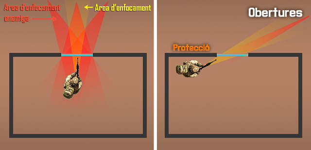

Aprofita el mobiliari per recolzar la teva arma, i així poder disparar amb més precisió, sense haver de treure l'arma per l'obertura.

### Zones fosques

Mira de mantenir-te a les zones fosques de les habitacions. Si et situes a una zona il·luminada per una finestra, és més fàcil que et vegin des de fora, en canvi a les zones fosques es molt difícil que et puguin detectar.

## Netejant un edifici

La neteja d'un edifici és una de les tasques més perilloses a la que un equip pot ser assignat, el que requereix una sòlida comprensió de tot l'equip de tàctiques CQB per tal de dur a terme amb èxit la neteja.

Note

Aquí només es donaran unes explicacions bàsiques del procediment, ja que es reserva el manual CQB per un monogràfic apart del curs.

### Per què netejar un edifici

Hi ha moltes raons per les quals pots necessitar que un edifici sigui netejat amb infanteria. Algunes d'aquestes raons són:

  -   - **Has d'assegurar l'edifici, però no pots demolir-lo per qualsevol de les següents causes:**
        
          - L'àrea és massa calenta per a col·locar amb seguretat explosius.
        
          - No hi ha explosius disponibles, o no es pot prescindir dels explosius a causa de les necessitats operatives.
        
          -   - El dany col·lateral és una preocupació.
                
                  - Restriccions RD.
                  - Civils dins o prop.
        
          - A l'edifici es troben béns que no poden ser destruïts, com a material d'intel·ligència, presos, etc.

  -   - **L'edifici presenta una amenaça a la seguretat de les forces amigues i ha de ser netejat per garantir la seguretat.**
        
          - Una amenaça que es percep quan els combatents enemics són coneguts o sospitosos d'estar dins. Podrien ser tiradors, observadors, disparadors.

  -   - **L'edifici s'identifica com a terreny clau.**
        
          - Ofereix una bona posició per fer servir si es pren.
          - Prenent l'edifici es nega una posició defensiva efectiva a l'enemic.
          - És un objectiu.

### Equips de cobertura i neteja

Per tal de netejar efectivament un edifici, un element s'ha de dividir en dues parts, una és l'equip de cobertura, que proporciona seguretat exterior de l'estructura. L'altre és l'equip de neteja, que entra en l'estructura per netejar d'habitació en habitació. L'equip de cobertura és normalment el líder de l'equip de foc i la parella de fuseller automàtic / assistint de fuseller automàtic, mentre que l'equip de neteja es compon de fusellers de l'equip de foc.

L'equip de neteja ha de conèixer el pla abans d'arribar al punt d'entrada de l'estructura, i ha de ser cobert per l'equip de cobertura en la seva aproximació fins al punt d'entrada.

  -   - **L'equip de la cobertura és responsable de:**
        
          - La supressió de la construcció, mentre que l'equip de neteja es mou a la seva posició.
          - La supressió dels pisos on l'equip de neteja no està.
          - La comunicació amb l'equip de neteja per coordinar dita supressió.
          - La prevenció que les forces hostils surtin de l'edifici.

  -   - **L'equip de neteja és responsable de:**
        
          - Moure's metòdicament a través de l'estructura, habitació per habitació, fins que siguin netes de forces hostils
          - Comunicació dels seus desplaçaments a l'equip de cobertura de manera que l'equip de cobertura pugui canviar el foc en conseqüència.

### Mètodes d'agrupament i entrada

Hi han dues maneres d'agrupar-se abans d'entrar, i decidir quina fer servir depèn de diferents factors.

  - **Agrupació –** En aquesta, tothom es col·loca al mateix costat de l'entrada. És l'agrupació normal a fer servir, i és especialment indicada per quan l'entrada és oberta, ja que moure's cap a l'altre costat de l'entrada podria alertar l'enemic.
  - **Agrupació partida –** En aquesta, l'equip es divideix per igual a cada costat de l'entrada. Es pot fer servir quan l'entrada està tancada i per tant l'enemic no pot tenir visual de res que creui la porta. Permet una entrada més fluida de l'equip.

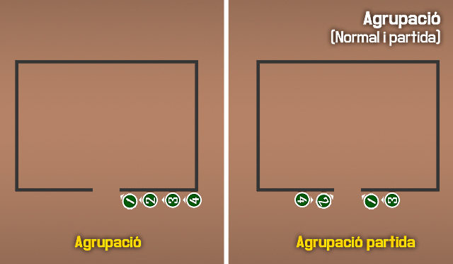

Quan es tracta d'entrar en una habitació, els membres de l'equip de neteja tenen dues opcions.

  - **Ganxo -** En aquesta, travesses la porta i immediatament gires cap al costat on estaves agrupat abans d'entrar. Per exemple, si estaves al costat dret de la porta, entraràs per la porta i immediatament giraràs a la dreta.
  - **Creu -** En aquesta, travesses la porta i continues cap al costat contrari on estaves agrupat abans d'entrar. Per exemple, si estaves al costat dret de la porta, entraràs per la porta i giraràs cap a l'esquerra.

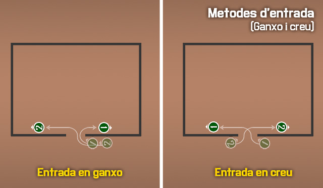

### Procediments de neteja d'una habitació

Per tal de netejar una habitació amb seguretat, evitant el foc creuat i maximitzant l'eficàcia de l'equip, cal seguir unes pautes fixes, que permetin que tot l'equip sàpiga què fer en cada moment sense necessitat de comunicacions de més.

La idea de la neteja d'una habitació és fer servir la sorpresa, i posar tots els membres de l'equip de neteja dintre de l'habitació en el menor temps possible cobrint tots els angles.

#### Zones de perill

Les habitacions es divideixen en 4 zones de perill, de més a menys. La primera zona de perill és el mateix cantó a on estem situats abans d'entrar, ja que és on no tenim visual de la zona. La segona zona de perill és el cantó contrari. La tercera zona de perill és la part central del mateix costat a on estem agrupats. I per tant la quarta zona de perill és la part central del costat contrari a on estem agrupats.

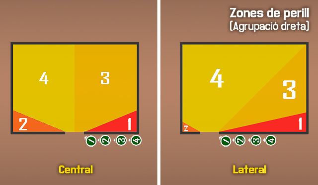

#### Àrea de responsabilitat

Cada soldat te encarregat una Àrea de responsabilitat «AR». Durant tot el procés de neteja has de centrar-te només en la teva àrea, deixar de cobrir-la donarà lloc a un forat en la defensa.

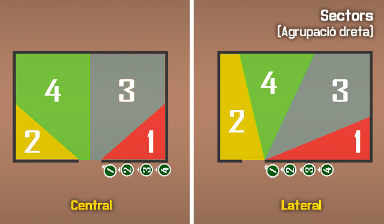

#### Obstacles

Qualsevol objecte dintre de l'habitació que bloquegi la nostra visió d'una part de la mateixa, es considera un obstacle. Armaris, taules tombades, parets, etc... són obstacles i s'han de tractar amb especial cura, ja que poden tenir enemics amagats.

#### Execució

Sobre el supòsit d'un equip de neteja de 4 soldats, que és el mínim ideal, el líder de l'equip serà el numero 3 sempre, i en cas que un membre fos un fuseller automàtic, seria el 4.

Primer, el líder de l'equip de neteja designa per on entrar i com agrupar-se. En aquest cas serà una entrada central.

<table>
<tbody>
<tr class="odd">
<td><strong>3: Agrupats porta dreta.</strong></td>
</tr>
<tr class="even">
<td>Tothom s'agrupa a la porta de la dreta al mateix costat.</td>
</tr>
</tbody>
</table>

Un cop agrupats, el líder indica el mètode per entrar.

<table>
<tbody>
<tr class="odd">
<td><strong>3: Porta dreta.</strong></td>
</tr>
</tbody>
</table>

Aquí ja estaríem preparats per entrar, però si la situació ho permet, es pot fer una confirmació prèvia, indicant de darrera cap endavant que s'esta preparat. Es pot fer simplement dient el nostre número, o amb l'AGM fent servir l'opció de tocar l'espatlla del company al que apuntem. Tecla d'interacció .

<table>
<tbody>
<tr class="odd">
<td><strong>3: Porta dreta.</strong></td>
</tr>
<tr class="even">
<td>4: Quatre!</td>
</tr>
<tr class="odd">
<td>3: Tres!</td>
</tr>
<tr class="even">
<td>2: Dos!</td>
</tr>
<tr class="odd">
<td>1: Un!</td>
</tr>
</tbody>
</table>

Important

Fixa't com el líder de l'equip, que és tres, també ha de confirmar que està llest.

Ara que ja estem col·locats, i sabem cap a on gira el primer soldat, només queda donar l'ordre d'entrar. A no ser que s'indiqui el contrari, les direccions d'entrada sempre s'intercalen, si el primer per exemple gira a dreta, el següent ho farà a l'esquerra i el següent cap a la dreta.

<table>
<tbody>
<tr class="odd">
<td><strong>3: Entreu!</strong></td>
</tr>
</tbody>
</table>

Tothom entra en ordre, segons la direcció que li toca fent servir com a guia el primer soldat en entrar. El primer en entrar avisa de la seva entrada, **només cal que ho avisi el primer**.

<table>
<tbody>
<tr class="odd">
<td>1: Entrant!</td>
</tr>
</tbody>
</table>

El numero 1 entra i gira cap al costat designat abans d'entrar, en aquest exemple la dreta, apunta cap a la cantonada del final sense aturar-se (sector 1), un cop neta la cantonada gira cap a l'esquerra, a la cantonada davantera (sector 3) i aquest és el seu sector final. No ha d'arribar al final de l'habitació, però si deixar espai perquè el numero 3 pugui posicionar-se a la seva esquerra.

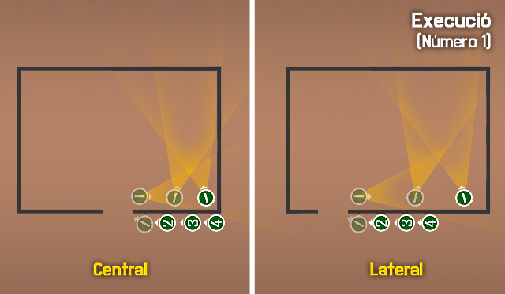

El número 2 entra i gira cap a l'esquerra, el costat contrari del primer, apunta cap a la cantonada del final sense aturar-se (sector 2), un cop neta la cantonada gira cap a la dreta, a la cantonada davantera (sector 4) i aquest és el seu sector final.

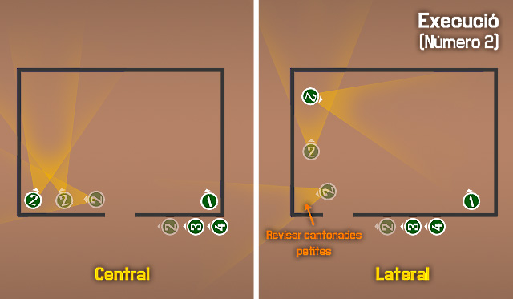

El número 3 entra i gira a la dreta, apunta cap a la cantonada davantera de la dreta (sector 3), i es situa al costat del número 1, deixant una mica d'espai i fora del llindar de la porta per no entorpir l'entrada. Aquest és el seu sector final.

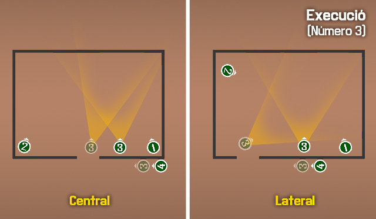

El número 4 entra i gira a l'esquerra, apunta cap a la cantonada davantera de l'esquerra (sector 4), i es situa al costat del número 2. Aquest és el seu sector final.

Un cop assolida la posició final de cada membre, s'ha de notificar al grup si els dos costats de l'habitació estan nets o no. Els líders de cada parella són sempre el 3 i el 4, per tant són ells qui porten les comunicacions, sempre en ordre.

Les estàncies segueixen un patró similar sempre en ser construccions humanes, i es poden dividir en rectangles gairebé sempre. Per tant pots tenir només dues entrades possibles, laterals i centrals. Les entrades laterals són aquelles entrades que estan situades molt a prop d'un cantó de l'habitació o són al mateix cantó. Les entrades centrals són per tant aquelles que no són laterals. Per saber si una entrada és central i no lateral cal que permeti el posicionament de dos membres a la mateixa paret de l'entrada, si només en permet un o cap, és una entrada lateral.

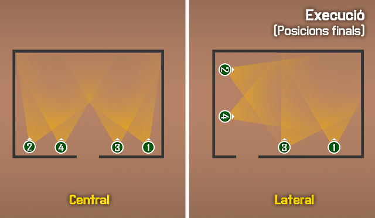

<table>
<tbody>
<tr class="odd">
<td>4: Esquerra neta!</td>
</tr>
<tr class="even">
<td>3: Dreta neta!</td>
</tr>
<tr class="odd">
<td>3: Tres!</td>
</tr>
</tbody>
</table>

Important

Per notificar la neteja es comença des del final. Un cop es determina que està neta l'habitació, el líder de l'equip de neteja ho ha de comunicar.

Important

- **En tot moment t'has de mantenir enganxat a la paret de l'entrada,** ja que si avances per l'habitació ets situes en la línia de foc dels companys. En entrades centrals, la mateixa paret de l'entrada, i en entrades laterals, les dues parets de la cantonada de l'entrada.
- **En cap moment pots deixar d'avançar cap a la teva posició final,** encara que disparis, ja que si no estàs bloquejant els companys.
- **Els dos primers en entrar tenen assignats els sectors 1 i 2,** per tant només es podria disparar a enemics en el sectors 3 i 4 quan s'entra si són trets d'oportunitat que no aturin el moviment. De res serveix que eliminis un enemic al sector 3, si el que està al sector 1 té temps d'eliminar-te davant de la porta, bloquejant els teus companys.
- **Abans d'entrar s'ha de revisar el carregador,** no vols entrar amb poques bales.
- **En cas de no tenir equip de cobertura el número 4 es pot quedar davant de la porta per dintre cobrint cap enfora,** així s'evita que l'equip sigui sorprès per darrera.
- **Quan l'equip surti d'un edifici, ha d'avisar a les unitats de fora,** indicant el número de soldats que surten, per exemple **Quatre sortint\!**. Aixi s'evita el foc amic.

!!! important
    - wr2
    - erwer
    - werw231321

!!! important
    sdfsdfsd

.. Important::

 * **En tot moment t'has de mantenir enganxat a la paret de l'entrada,** ja que si avances per l'habitació ets situes en la línia de foc dels companys. En entrades centrals, la mateixa paret de l'entrada, i en entrades laterals, les dues parets de la cantonada de l'entrada.
 * **En cap moment pots deixar d'avançar cap a la teva posició final,** encara que disparis, ja que si no estàs bloquejant els companys.

!!! seealso "Veure també"
	afws

??? note
	Titol personalitzat

!!! topic
	Titol personalitzat

!!! Attention
	Directives at large.

!!! Caution
	Don't take any wooden nickels.

!!! DANGER
	Mad scientist at work!

!!! Error
	Does not compute.

!!! Hint
	It's bigger than a bread box.

!!! Note
    Equations within a note

!!! WARNING
    Reader discretion is strongly advised.

!!! admonition
    You can make up your own admonition too.

#### Neteja amb granades

En cas de disposar de granades, les pots fer servir per eliminar o anul·lar els enemics abans d'entrar, fent més segura així l'entrada de l'equip. Hi han diferents tipus de granades a fer servir, però per limitacions actuals del simulador, en centrarem en només dues, de fragmentació i cegadores.

Normes per saber si fer-les servir.

  - **Granades letals –** Només pots fer-les servir si saps segur que no hi ha civils o tropes amigues dintre de l'habitació, o bens d'importància. I si les parets són prou gruixudes i fortes perquè la metralla no la travessi i fereixi al teu equip.
  - **Granades no letals –** Es poden fer servir encara que hi hagi civils, però s'ha de tenir una especial cura.

##### Granades cegadores

Les granades cegadores compleixen dos propòsits, deixar cecs i sords als enemics, gràcies al potent flaix i als 170 decibels (dB) que emeten.

Un cop agrupats, el líder ordena fer servir granada cegadora.

<table>
<tbody>
<tr class="odd">
<td><strong>3: Cegadora.</strong></td>
</tr>
<tr class="even">
<td>2: Cegadora llesta!</td>
</tr>
<tr class="odd">
<td><strong>3: Espera, espera, llança!</strong></td>
</tr>
</tbody>
</table>

És el número 2 qui s'encarrega de preparar i llançar la granada, mentre 1 cobreix al davant. **És vital esperar la detonació abans d'entrar**.

Les granades cegadores s'han de llançar a 1 metre de la porta, és a dir al radi d'obertura de la mateixa, mai al centre de l'habitació. No vols que la granada afecti a tothom dintre, el que vols és que deixi cecs als enemics que estan veient la porta, per això es llança al costat de la mateixa.

##### Granades de fragmentació

Les granades de fragmentació només compleixen un propòsit, eliminar els enemics dintre de l'habitació, tot i que com a efectes secundaris mantenen la desorientació degut a la detonació.

Un cop agrupats, el líder ordena fer servir granada de fragmentació.

<table>
<tbody>
<tr class="odd">
<td><strong>3: Fragmentadora.</strong></td>
</tr>
<tr class="even">
<td>2: Fragmentadora llesta!</td>
</tr>
<tr class="odd">
<td><strong>3: Espera, espera, llança!</strong></td>
</tr>
</tbody>
</table>

És el número 2 qui s'encarrega de prepara i llançar la granada, mentre 1 cobreix al davant. **És vital esperar la detonació abans d'entrar**.

Les granades fragmentadores s'han de llançar al mig de l'habitació, per maximitzar l'eficàcia de la detonació i evitar que l'equip de neteja pugui resultar ferit.

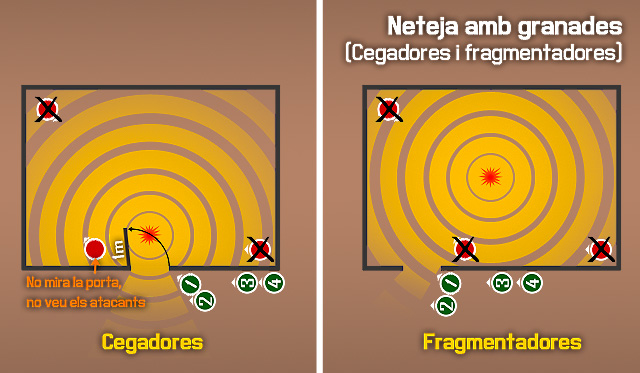

### Procediment de recarrega

En una situació CQB, l'equip ha de mantenir en tot moment la cobertura. Si un membre de l'equip ha de deixar de cobrir per qualsevol motiu, abans s'ha d'assegurar que un company s'encarregui de vigilar també el seu sector.

En el cas de la recàrrega, el procediment a seguir es el següent:

<table>
<tbody>
<tr class="odd">
<td><strong>2: Recàrrega!</strong></td>
</tr>
<tr class="even">
<td>1: Cobrint!</td>
</tr>
<tr class="odd">
<td>2: Recarregant...</td>
</tr>
<tr class="even">
<td><strong>2: Llest!</strong></td>
</tr>
</tbody>
</table>

Aquí 2 notifica que necessita recarregar, llavors el seu company (o si no el que tingui més a prop) avisa que el cobreix, informant 2 quan està recarregant i quan ha enllestit l'acció.

### Avançaments per passadissos

A l'hora d'avançar per passadissos, les dues parelles es situarien en paral·lel, cobrint tots cap al davant, i avançant al mateix temps, cobrint el costat contrari en cas d'arribar a un altre passadís o obertura.

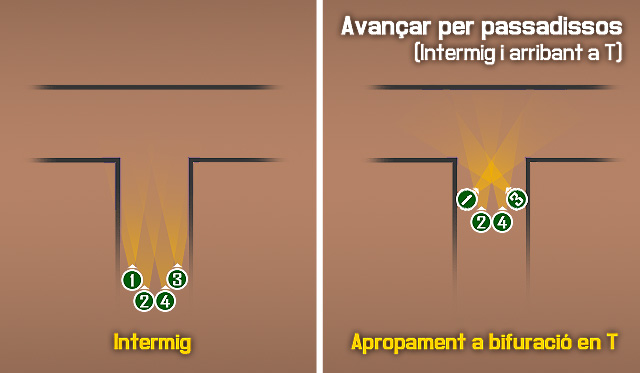

### Neteja de cantonada

Et pots trobar tres tipus de cantonades, simple, dobles (bifurcació en T) i creuades (cruïlla).

#### Cantonada simple

En aquest cas, el numero 1 i 3 es situaran a la cantonada i coordinant-se, trauran el cap a l'hora amb l'arma preparada per disparar, l'1 ajupit perquè el 3 pugui apuntar.

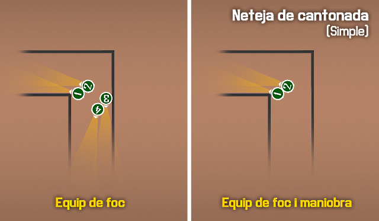

#### Cantonada doble

La tècnica és la mateixa que amb la cantonada simple, però els dos equips ho faran a l'hora.

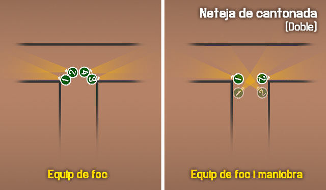

#### Cantonada creuada

En aquest cas, 1 i 3 cobreixen les cantonades mentre 2 i 4 creuen cap a l'altre costat, mantenint 4 sempre la cobertura posterior, i llavors 1 i 3 es reuneixen amb 2 i 4.

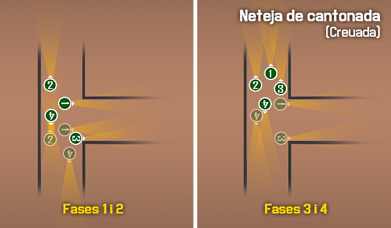

## Demolició d'un edifici

### Per què es demoleix un edifici

La demolició d'edificis és una decisió important a prendre en una missió. Els edificis poden ser qualsevol cosa, des de cases, a fàbriques, búnquers, etc. Per destruir-los es requereix molta potència explosiva, i l'ús d'aquesta potència ha de ser considerat acuradament. L'edifici ha de presentar una amenaça per a les forces amigues que sigui prou significativa perquè la destrucció de la mateixa sigui raonable.

Algunes de les consideracions que s'han de fer abans de la demolició són les següents:

  - El dany col·lateral no és una preocupació.
  - Demolir l'edifici no té un impacte negatiu en els objectius de la missió.
  - Els actius de demolició són disponibles (carregues de motxilla, blindats, CAS) i es poden emprar amb èxit.
  - L'edifici compta amb una important cobertura de les àrees operatives amigues (per part de l'enemic) i no es pot assegurat o ocupat, pel que és un risc de seguretat.
  - Els enemics són coneguts o altament sospitosos d'estar a l'interior i la neteja de l'edifici probablement pugui causar baixes amigues inacceptables.

### Preparació per demolir un edifici

Quan un edifici s'ha assenyalat per a la demolició, el primer pas és que les unitats amigues el suprimeixin, l'aïllin, i estableixin la seguretat al seu voltant. L'aïllament és l'acte d'assegurar que ningú a l'interior de l'edifici sigui capaç d'escapar, i ningú fora d'ell no pugui entrar. La supressió ajuda a evitar que qualsevol persona dins pugui atacar a les forces amigues mentre que la demolició es duu a terme. La seguretat assegura que les forces que treballen per demolir l'edifici estan protegides dels atacs de qualsevol altre hostil a la zona.

L'aïllament, la supressió, i la seguretat es poden aconseguir a través de la col·locació correcta d'esquadres i els seus fusellers automàtics, equips de metralladores adjunts, o vehicles armats.

### Opcions de demolició disponibles

Quan es tracta de la destrucció d'un edifici, hi ha diverses opcions disponibles, depenent de la missió i els actius actuals. Cobrirem els pros, els contres, i les distàncies mínimes de seguretat recomanades per a cadascuna de les principals opcions de sota. En última instància, la decisió de quin tipus de demolició s'utilitzarà recau en el líder sènior de l'element de demolició, típicament el líder d'esquadra o el comandant de l'escamot.

  -   - **Carregues de motxilla**
        
          -   - **Pros**
                
                  - Mètode molt precís i controlat de demolició.
                  - Pot ser coordinat i portat a terme molt ràpidament.
                  - Es pot fer amb sigil per evitar que l'enemic reaccioni abans que sigui massa tard.
        
          -   - **Contres**
                
                  - De curt abast. Requereix d'infanteria que es mogui a l'edifici i col·loqui els explosius i exposant-los al foc enemic.
                  - Pot requerir diverses càrregues explosives per aconseguir la completa destrucció.
        
          -   - **Distància de seguretat**
                
                  - Sense cobertura: 30-60 metres
                  - Amb forta cobertura: 15 metres

  -   - **Suport blindat**
        
          -   - **Pros**
                
                  - Mètode molt precís i controlat de demolició.
                  - Pot ser coordinat i portat a terme de forma ràpida si el suport blindat és a prop de la infanteria.
                  - El blindat pot tant demolir l'edifici com atacar selectivament objectius dins d'ell amb el canó o les metralladores.
                  - Pot ser utilitzat a una llarga distància de l'objectiu.
        
          -   - **Contres**
                
                  - Si el blindat no està a prop de la infanteria amiga, pot portar el seu temps d'aconseguir que estigui preparat, el que pot advertir a l'enemic del que està succeint.
                  - Pot prendre més temps per demolir un edifici peça a peça.
        
          -   - **Distància de seguretat**
                
                  - Sense cobertura: 200-300 metres
                  - Amb forta cobertura: 150 metres

  -   - **Suport aeri proper (CAS)**
        
          -   - **Pros**
                
                  - Alt poder de destrucció, amb diferents opcions segons necessitat.
                  - Pot ser molt precís amb guia làser.
                  - Es pot demanar des d'una llarga distància de l'objectiu.
        
          -   - **Contres**
                
                  - El poder destructiu del CAS pot resultar en incidents de foc amic horribles si les forces de terra no prenen les precaucions adequades, o si el FAC no controla l'execució correctament.
                  - El CAS pot ser lent de respondre a una sol·licitud de suport.
                  - Les bombes no guiades per làser poden ser imprecises i requereixen un grau extra d'una acurada coordinació entre el FAC i els avions per evitar el fratricidi.
        
          -   - **Distància de seguretat**
                
                  - Sense cobertura: 200-300 metres
                  - Amb forta cobertura: 150 metres

  -   - **Suport d'artilleria**
        
          -   - **Pros**
                
                  - Varietat de tipus d'efectes i tipus d'espoleta.
                  - Gran poder de destrucció, capacitat de mantenir el foc durant uns minuts.
                  - Pot destruir un edifici i tot el seu voltant.
                  - Es pot demanar des d'una llarga distància de l'objectiu.
        
          -   - **Contres**
                
                  - Cridar l'artilleria i esperar a que els projectils impactin pot portar temps.
                  - Menys precís que altres mètodes. Pot requerir un ajust per aconseguir impactes en l'objectiu.
                  - Requereix una quantitat addicional de distància de separació per evitar el fratricidi.
        
          -   - **Distància de seguretat**
                
                  - Sense cobertura: 350-500 metres
                  - Amb forta cobertura: 250 metres
