# Punteria avançada amb fusell

Per acabar d'assolir els coneixements bàsics de la punteria amb fusell, hauràs d'aprendre els conceptes bàsics de les mires. Hi ha un ampli ventall de mires per fer servir, òptiques, hologràfiques... però en aquest capítol només aprendràs un model concret, la ACOG TA31RCO, que podràs extrapolar a d'altres mires, ja que el concepte de funcionament és similar.

## ACOG TA31RCO

**ACOG** es l'acrònim de **ADVANCED COMBAT OPTICAL GUNSIGHT** (**Mira Avançada Òptica de Combat** en català). És una mira d'augments amb retícula il·luminada i marques tant de mesura com de distància de foc. Ofereix un foc efectiu i ràpid pel soldat a curta, mitja i llarga distància.

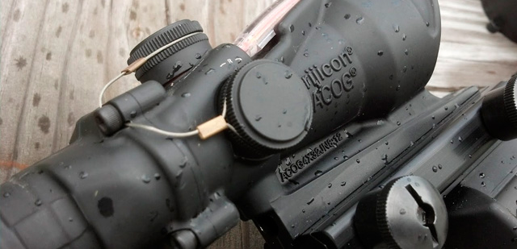

  - **Magnificació:** 4x
  - **Mida objectiu (mm):** 32
  - **Compensador caiguda de bala:** Sí
  - **Longitud (mm):** 17,02
  - **Pes (grams):** 491
  - **Font d'il·luminació:** Fibra òptica & Tritium
  - **Patró de retícula:** Xebró amb Sistema de referencia d'objectiu
  - **Color diürn retícula:** Vermell
  - **Color nocturn retícula:** Vermell
  - **Concepte d'apuntat Bindon:** Sí

### Patró de retícula

L'ACOG té un patró tipus **Xebró (Chevron)** amb sistema de referència d'objectius que ens permet mesurar la distància de l'objectiu i disparar ràpidament a diferents distàncies sense necessitat de regular la mira.

Amb l'ACOG podem abatre objectius fins a 800 metres fent servir el compensador de caiguda de la bala.

#### Mesurar la distància amb l'objectiu

Per saber a quina distància estem de l'objectiu, hem de fer servir l'amplada del mateix. Fent coincidir l'amplada del nostre objectiu amb la marca correcta, ens dóna la distància a l'objectiu. Per exemple, un objectiu que faci la mateixa amplada que la marca 6, vol dir que està a 600m de distància.

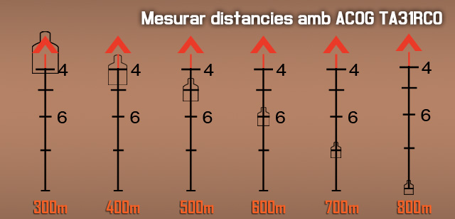

#### Disparar a diferents distàncies

A l'hora de disparar a diferents distàncies, l'únic que hem de fer és apuntar amb la marca corresponent als metres de distància a l'objectiu.

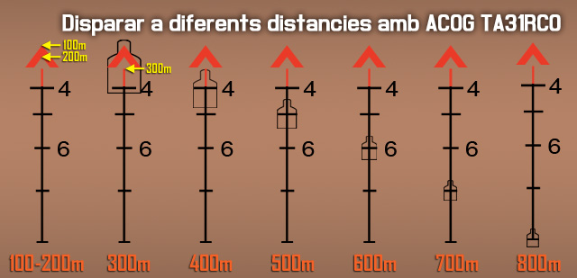

#### Sistema de referència d'objectiu

La mira té unes marques horitzontals que es fan servir principalment per indicar la posició d'objectius, aquest sistema es diu **TRS "Target Reference System"**.

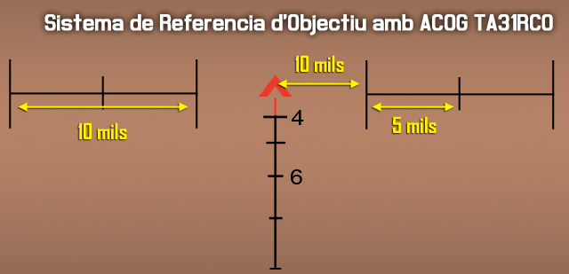

### Efectes del vent

Per compensar l'efecte del vent en la trajectòria de la bala, pots fets servir aquesta il·lustració.

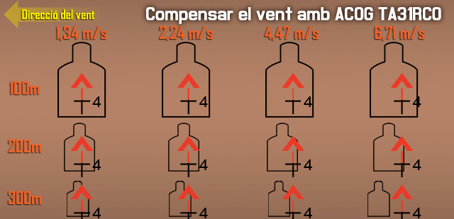

### Objectius en moviment

A l'hora de disparar a objectius en moviment, has de considerar 4 coses.

  - Velocitat de l'objectiu.
  - Angle de moviment de l'objectiu.
  - distància a l'objectiu.
  - Efectes del vent.

**Velocitat de l'objectiu** Pots considerar tres tipus de velocitats per un humà: Caminar, Caminar ràpid (o trot), i Córrer.

**Angle de moviment** En angles entre 0º i 15º, s'ha de considerar com un objectiu estàtic.

**Distància a l'objectiu** En distàncies inferiors a 50m es pot obviar la compensació.

**Efectes del vent** Has de sumar el càlcul de vent a la velocitat de moviment.

Per compensar la velocitat de l'objectiu, pots fer servir aquesta il·lustració.

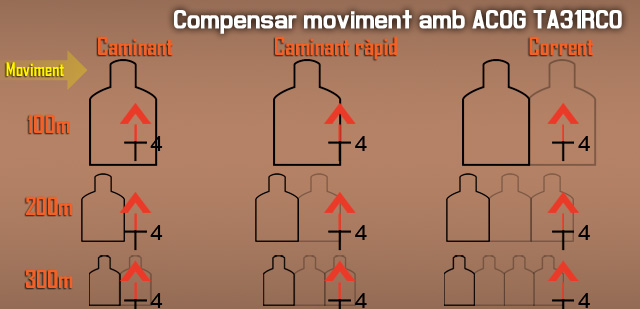

## Recarregues

Recarregar és una acció on sovint no hi pensem. Però, pot ser fàcilment la diferència entre l'eficàcia en combat i la mort absoluta.

### Consells i consideracions de les recàrregues

  - **Esforça't sempre en recarregar a cobert o ocult.** Com a mínim un genoll a terra per reduir el teu perfil, o estirat al terra si la situació ho requereix. Pots recarregar i moure't a l'hora, però si tens cobertura o on ocultar-te a prop, aprofita-ho.
  - **Has de saber quan cridar una recàrrega o que estàs sense munició.** Quan fer-ho ve determinat per quant important es dir-ho. Si ets un fuseller a una esquadra gran, no cal avisar ja que només trigaràs un moment, i la teva carència de foc no afecta de manera significant a tota l'esquadra. En canvi si tu estàs proveint una elevada potencia de foc i/o portes un arma que triga molt a recarregar-se (com pot ser una M240), o ets un element crític (un antitanc), has d'avisar del teu estatus perquè els companys puguin reaccionar adequadament. El sentit comú s'ha d'aplicar per saber quan fer-ho.

Quan cridis una recàrrega, simplement indica l'arma, l'acció que estàs fent, i qualsevol reacció que hagin de tenir els companys, per exemple "M240 recarregant\! Doneu-me cobertura". Quan la recarrega sigui completa només cal indicar l'arma o el nom i 'llest', "M240 llesta\!".

Note

Encara que siguis només un rol de baixa importancia, com un fuseller, si estàs en una situació d'alta reacció, com un combat CQB, també has d'avisar de les recarregues.

### La norma del mig carregador

**Sempre que disparis, has de procurar canviar el carregador a mitja capacitat.** No esperis a que es buidi el carregador, canvia'l quan estigui més o menys a la meitat. El simulador, com a la vida real, manté el numero de bales restants als carregadors de forma independent. Això vol dir que si tens dos carregadors, i canvies el carregador de l'arma amb tres bales per un de nou, al teu inventari tindràs un carregador amb tres bales més el carregador complet a la pròpia arma.

Com que mantens els carregadors, és sempre preferible tenir carregadors a la meitat, que carregadores buits o amb poques bales. Per tant, sempre s'ha de canviar el carregador quan estigui mig buit.

Els carregadors de fusell solen ser de 30 bales, per tant s'ha de canviar a les 15 bales més o menys.

### Recàrrega tàctica

Una recàrrega tàctica és una recàrrega que es realitza durant un període de calma en l'acció per reemplaçar un carregador parcialment buit amb un de nou. Has de verificar el teu carregador abans de fer alguna cosa perillosa (per exemple, un combat CQB), assaltar un objectiu, etc, i fer una recàrrega tàctica si tens menys d'un carregador ple, o qualsevol dubte pel que fa a la capacitat del teu carregador actual. El pitjor so en combat és escoltar un clic quan tu vols sentir una explosió.

### Recàrrega en sec

L'altra forma de recàrrega es coneix com una "recàrrega en sec". Aquesta és una recàrrega que es realitza amb un carregador buit, és a dir, el carregador ha sigut gastat completament. Les recàrregues en sec són completament acceptables en un gran nombre de situacions, com quan actues com un element de foc base mantenint una cadència de foc elevada sobre un objectiu distant. No obstant això, hi ha certes situacions en les quals una recàrrega en sec s'ha d'evitar, per exemple en combats a curta distància. Així que es recomana seguir sempre la norma del mig carregador.

## Tipus de foc

Hi han diversos tipus diferents de foc que poden ser utilitzats. Seguidament exposarem els més importants. El que hauràs d'emplear amb més freqüència com a soldat d'infanteria és el "foc d'àrea", però la resta també són útils i importants.

### Foc puntual

Aquest és el tipus de foc més bàsic. Has de veure l'enemic amb prou claredat com per poder obrir foc directament sobre ell. L'efectivitat del foc puntual depèn de les mires, la precisió i la capacitat letal de l'arma que s'utilitza. El foc puntual és més efectiu si es pren un cert temps entre tret i tret per apuntar. La situació tàctica però pot requerir un mètode d'intervenció més ràpid.

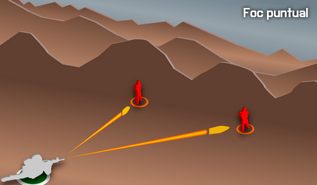

Quan un element està utilitzant foc puntual, normalment es realitza contra un objectiu molt visible o grup d'objectius que poden ser atacats amb precisió. Una esquadra enemiga emboscada a camp obert, per exemple, seria un exemple d'una situació en la que s'empraria foc puntual. Un vehicle de poc blindatge com un camió de transport seria un altre bon exemple.

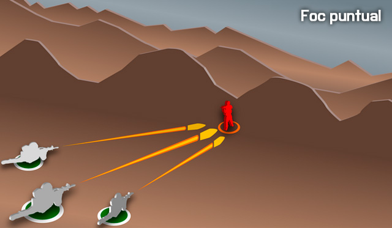

El foc puntual també podria ser utilitzat si un equip de foc està tractant de suprimir i destruir un edifici o búnquer específic, etc.

### Foc d'àrea

Aquesta tècnica posa un volum de foc en una àrea específica en lloc d'un objectiu individual específic. Es pot utilitzar per disparar contra les unitats enemigues ocultes, agrupades, o a una distància on el foc puntual seria lent i inofensiu.

Quan un element dispara sobre una àrea concreta, cada tirador individual apunta als llocs coneguts, sospitats o probables dels enemics, i els ruixa amb foc. L'èmfasi està en el volum concentrat i pesat de foc. Com més bales disparades contra l'enemic, més gran és la probabilitat d'impactar, i és més probable que aquest es trobi en una situació de supressió degut al volum de foc.

El foc d'àrea es realitza normalment amb una cadència més ràpida que el foc puntual, però no tan ràpida com el foc de supressió.

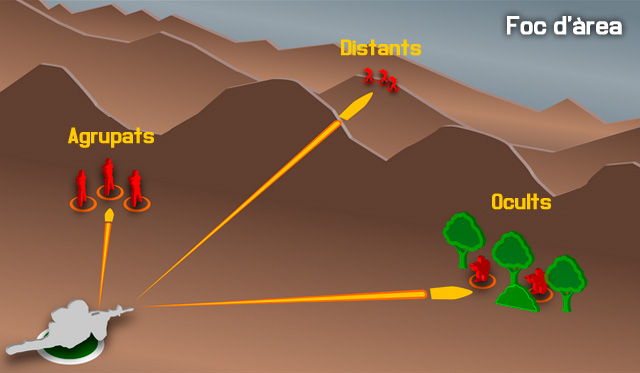

### Fos de supressió

Aquest és l'acte de posar un alt volum de foc contra una posició enemiga per evitar que siguin capaços de retornar foc efectiu.

Tingues en compte que la supressió només és eficaç si es pot fer creure a l'enemic que treure el cap per retornar el foc donarà lloc a que siguin ferits o morts. No és necessari impactar, però cal fer-los creure que serà així si no es posen a cobert. La supressió es pot utilitzar per a "mantenir" una força enemiga quieta mentre que un altre element es mou al voltant del seu flanc per atrapar-la pel seu costat sense protecció o més vulnerable.

El foc de supressió es realitza amb una cadència molt elevada en començar, per tal d'aconseguir la superioritat de foc. Un cop la superioritat de foc s'ha aconseguit, l'element de supressió pot alentir el ritme del seu foc per facilitar la gestió de munició, sempre que es mantingui un ritme que asseguri la supressió contra l'enemic.

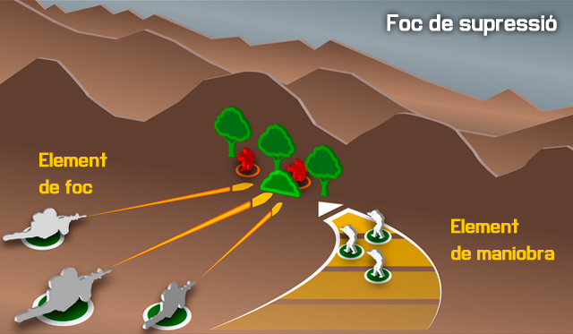

### Foc indirecte

El foc indirecte és simplement disparar sobre un objectiu o ubicació on la munició segueix un patró arquejat, el que li permet col·locar-se en àrees que estan fora de la visió directa del tirador. El foc indirecte es pot utilitzar per cobrir "espai morts", és a dir fora de la vista de qualsevol actiu de foc directe (per exemple, metralladores, fusells, etc.).

A nivell de grup, el foc indirecte normalment prové dels llançagranades com el Mk32, o el M203. Els morters i l'artilleria són els germans grans, quan es tracta de foc indirecte.

Un gran aspecte de foc indirecte és que l'enemic ho té més difícil per retornar el foc, ja que el tirador sol estar fora de la visió. D'aquesta manera la font és més difícil de localitzar, i fins i tot després de la ubicació, l'enemic no pot fer servir armes de foc directe i ha de confiar en els seus propis actius de foc indirecte o s'ha de moure cap a la font del foc.

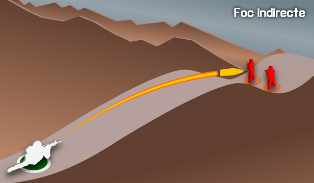

## Tipus de focs relatius a l'objectiu

Aquest diagrama mostra els diferents tipus de foc relatius a l'objectiu.

  - El foc **Enfilat** és un foc que coincideix amb el llarg de l'eix de l'objectiu.
  - El foc de **Flanc** és impactar l'objectiu des d'un costat.
  - El foc **Oblic** és impactar l'objectiu des de l'angle.
  - El foc **Frontal** és impactar l'objectiu des del front.

El foc de flanc, oblic, i el foc frontal poden convertir-se en foc enfilat simplement segons l'orientació de la formació enemiga pel que fa a la posició del tirador.

El foc de enfilat és el més letal. El tirador només ha de fer petits ajustos al seu foc per impactar sobre múltiples objectius, i les bales que fallen un objectiu, poden impactar sobre un altre de situat més al darrera.

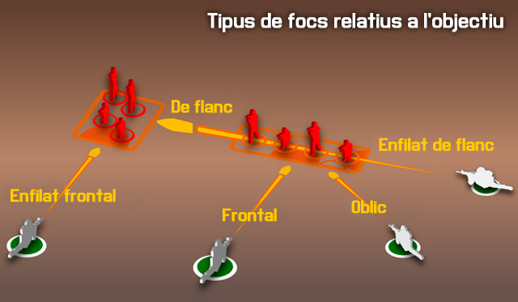
