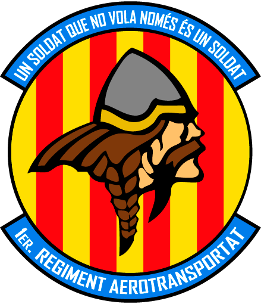

# Sobre el 1er Regiment Aerotransportat

**PROVA DE FONT CUSTOM1**

Press F to change

FM

Prem la tecla `F`

C-x C-f

> Control-x Control-f

Control-b

CTRL C

F

El **1er Regiment Aerotransportat** és un dels grups que pertany a la comunitat Catalana de simulació **Cavallers del Cel**. Dintre del **1RA** és realitzen missions de combat posant en practica tàctiques i estratègies reals en entorns altament hostils i amb un component de rol important per ajudar-nos a la immersió.

Per aconseguir completar les missions amb èxit, tenim un programa de reclutes on impartim classes de manera regular per formar als nous membres en una acadèmia virtual creada al simulador.

Si voleu contactar amb nosaltres ho podeu fer:

  - Al nostre web [cavallersdelcel.cat](http://www.cavallersdelcel.cat)
  - Al [fòrum del grup 1RA](http://www.cavallersdelcel.cat/forums/viewforum.php?f=26)
  - A nostre servidor de [Discord](https://discord.gg/4RGJdTv)

## Sobre el manual del EBC

Aquest curs està orientat a la formació bàsica dels reclutes. Partirem del supòsit que el recluta no te cap tipus de coneixements sobre la matèria, i per tant donarem una formació des de zero igual per a tothom.

L'EBC és un curs centrat en la formació més primordial, que pretén atorgar al recluta una bona base, per poder posteriorment fer entrenaments mes avançats.

Els curs es dividirà per fases, extretes de cursos reals d'infanteria, on progressivament s'anirà ampliant la formació de l'alumne. Cada fase podrà ser composta per una o diverses classes, depenent de la matèria i el temps disponible.

Un cop completat el curs, aprovant els exàmens que es facin, el Recluta ascendirà a Soldat.
