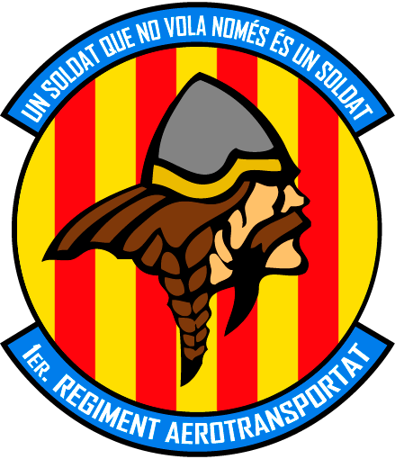

.. 1ra_ebc documentation master file, created by
   sphinx-quickstart on Tue Mar 27 13:05:43 2018.
   You can adapt this file completely to your liking, but it should at least
   contain the root `toctree` directive.
   
.. role:: raw-html(raw)
	:format: html

Benvingut al manual d'Entrenament Bàsic de Combat
=========================================================================

=================================================
Sobre el 1er Regiment Aerotransportat
=================================================

**PROVA DE FONT CUSTOM1**

Press :raw-html:`F` to change

.. raw:: html

	FM

Prem la tecla ``F``

:kbd:`C-x C-f`

	:kbd:`Control-x Control-f`

:kbd:`Control-b`

:kbd:`CTRL C`

:kbd:`F`

El **1er Regiment Aerotransportat** és un dels grups que pertany a la comunitat Catalana de simulació **Cavallers del Cel**. Dintre del **1RA** és realitzen missions de combat posant en practica tàctiques i estratègies reals en entorns altament hostils i amb un component de rol important per ajudar-nos a la immersió.

Per aconseguir completar les missions amb èxit, tenim un programa de reclutes on impartim classes de manera regular per formar als nous membres en una acadèmia virtual creada al simulador.

Si voleu contactar amb nosaltres ho podeu fer:

* Al nostre web `cavallersdelcel.cat`_
* Al  `fòrum del grup 1RA`_
* A nostre servidor de `Discord`_

.. _cavallersdelcel.cat: http://www.cavallersdelcel.cat
.. _fòrum del grup 1RA: http://www.cavallersdelcel.cat/forums/viewforum.php?f=26
.. _Discord: https://discord.gg/4RGJdTv

=================================================
Sobre el manual del EBC
=================================================

Aquest curs està orientat a la formació bàsica dels reclutes. Partirem del supòsit que el recluta no te cap tipus de coneixements sobre la matèria, i per tant donarem una formació des de zero igual per a tothom.

L'EBC és un curs centrat en la formació més primordial, que pretén atorgar al recluta una bona base, per poder posteriorment fer entrenaments mes avançats.

Els curs es dividirà per fases, extretes de cursos reals d'infanteria, on progressivament s'anirà ampliant la formació de l'alumne. Cada fase podrà ser composta per una o diverses classes, depenent de la matèria i el temps disponible.

Un cop completat el curs, aprovant els exàmens que es facin, el Recluta ascendirà a Soldat.

=================================================
Fases:
=================================================

.. toctree::
   :maxdepth: 1

   intro/introduccio

.. toctree::
   :maxdepth: 1
   :caption: Fase 1 - Groga

   fase1/benvinguda
   fase1/simulador

.. toctree::
   :maxdepth: 1
   :caption: Fase 2 - Vermella

   fase2/punteria1
   fase2/rdc
   fase2/navegacio
   fase2/camuflatge
   fase2/patrulla

.. toctree::
   :maxdepth: 1
   :caption: Fase 3 - Blanca

   fase3/punteria2
   fase3/prioritzar

.. toctree::
   :maxdepth: 1
   :caption: Fase 4 - Blava

   fase4/comunicacions
   fase4/punteria3
   fase4/maniobrar
   fase4/granades
   fase4/armes_tripulacio
   fase4/metralladores
   fase4/fusell_auto
   fase4/antitanc
   fase4/llan_granades
   fase4/mout
   fase4/comboi

.. toctree::
  :maxdepth: 1
  :caption: Notes finals

  notes/poc
  notes/bibliografia
  notes/credits
